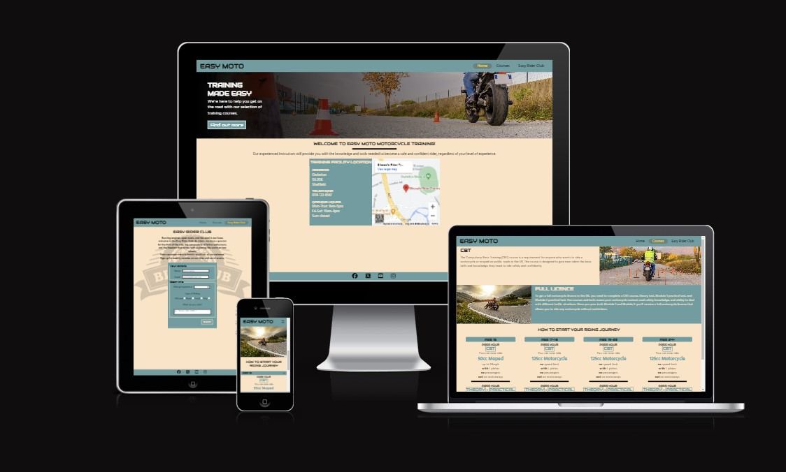

# Easy Moto

Easy Moto is a motorcycle training service where individuals can learn to ride and acquire licenses in a safe environment, taught by our experienced and certified instructors. Also, a social aspect is prevalent, where we encourage community rides and social meet-ups. The site is designed to lay out the structure of how to get a motorcycle license and supply support for future hobbyists through the Easy Rider Club.

## Features

### Existing Features

- _Navigation Bar_
- _Hero Image_
- _Map_
- _Courses Overview_
- _How to star your riding journey_
- _Easy Rider Club sign up form_

### Features Left to Impliment

- _Sign up form for courses_

## Testing

### Validator Testing

- HTML
  - No errors were returned when passing through the official [W3C validator](https://validator.w3.org/nu/?doc=https%3A%2F%2Fcode-institute-org.github.io%2Flove-running-2.0%2Findex.html)
- CSS
  - No errors were found when passing through the official [(Jigsaw) validator](https://jigsaw.w3.org/css-validator/validator?uri=https%3A%2F%2Fvalidator.w3.org%2Fnu%2F%3Fdoc%3Dhttps%253A%252F%252Fcode-institute-org.github.io%252Flove-running-2.0%252Findex.html&profile=css3svg&usermedium=all&warning=1&vextwarning=&lang=en#css)

### Unfixed Bugs

## Deployment

- The site was deployed to GitHub pages. The steps to deploy are as follows: 
  - In the GitHub repository, navigate to the Settings tab 
  - From the source section drop-down menu, select the Master Branch
  - Once the master branch has been selected, the page will be automatically refreshed with a detailed ribbon display to indicate the successful deployment. 

The live link can be found here - https://lukewtom93.github.io/easy-moto/easy-rider-club.html

## Credits

### Content

- The icons in the footer and how to start your riding journey were taken from [Font Awsome](https://fontawesome.com/)
- The fade across the hero image was taken from an answer from [stackoverflow.com](https://stackoverflow.com/questions/22666063/how-to-fade-the-edge-of-a-div-with-just-css)
- Acpects of CSS for the header navigation and footer were taken from Love Running - Essentials Project

### Media

- All the images used on the site are licenced by Adobestock