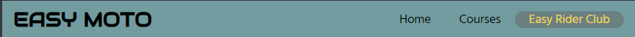

# Easy Moto

Easy Moto is a motorcycle training service where individuals can learn to ride and acquire licenses in a safe environment, taught by our experienced and certified instructors. Also, a social aspect is prevalent, where we encourage community rides and social meet-ups. The site is designed to lay out the structure of how to get a motorcycle license and supply support for future hobbyists through the Easy Rider Club.

## Features

### Existing Features

- _Navigation Bar_

    - Features on each page, fully responsive and easy to navigate. Link text changes colour and background on the active page. link to the home page in the Easy Moto logo.
    - This feature will provide a seamless and simple browsing experience for the user.

- _Hero Image_

    - The hero Image gives a clear target to the site, with a text overlay and a call to action button to move the user to the next page.
    - A fade across the image creates a good contrast for the text overlay 

- _Map_

    -This helps the customer find the location of the business with added contact information placed next to the map.
    -It nicely adapts to different screen sizes allowing a great user experience.

- _Courses Overview_

    - The course that Easy Moto provides is laid out in an easy-to-read format and responsive to different screen sizes.
    - Separate coloured text blocks make the CBT and Full Licence simple to navigate.

- _How to start your riding journey_

    - Up to 768px screens will get multiple drop-down boxes relating to age, starting with age 16 which is already open when the page is loaded, to help show the function to the user.
    - This section provides a clear outline of what is needed to start riding a motorbike.

- _Easy Rider Club sign-up form_

    - A form with mandatory user details inputs and optional riding experience info.
    - The form answers will help for further improvements for the user.

### Features Left to Implement

- _Sign up form for courses_

    - Some fields for submitting payment of the courses and further expansion of the amount on offer.

## Testing

### Validator Testing

- HTML
  - No errors were returned when passing through the official W3C HTML Validator
- CSS
  - No errors were found when passing through the official W3C CSS Validator (Jigsaw)

### Unfixed Bugs

- No unfixed bugs

## Deployment

- The site was deployed to GitHub pages. The steps to deploy are as follows: 
  - In the GitHub repository, navigate to the Settings tab 
  - From the source section drop-down menu, select the Master Branch
  - Once the master branch has been selected, the page will be automatically refreshed with a detailed ribbon display to indicate the successful deployment. 

The live link can be found here - https://lukewtom93.github.io/easy-moto/easy-rider-club.html

## Credits

### Content

- The icons in the footer and how to start your riding journey were taken from [Font Awsome](https://fontawesome.com/)
- The fade across the hero image was taken from an answer from [stackoverflow.com](https://stackoverflow.com/questions/22666063/how-to-fade-the-edge-of-a-div-with-just-css)
- Acpects of CSS for the header navigation and footer were taken from Love Running - Essentials Project

### Media

- All the images used on the site are licenced by Adobestock